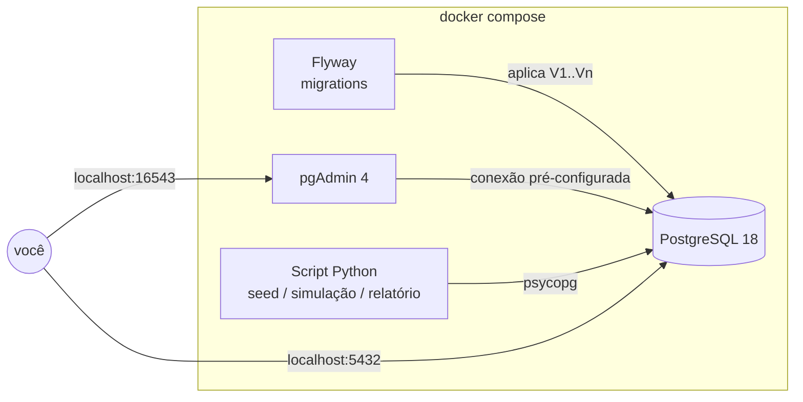

# Pauta Digital — PostgreSQL na prática

> Laboratório de PostgreSQL com Docker baseado em um caso de negócio fictício: a **Pauta Digital**, uma plataforma de revistas e newsletters por assinatura.

O objetivo deste repositório é ir além de "subir um Postgres no Docker": o banco nasce com um modelo de dados real, evolui por **migrations versionadas**, é populado com **dados realistas** e responde a **perguntas de negócio** com SQL — de joins simples a window functions, análise de coorte e tuning com `EXPLAIN ANALYZE`.

> **Status:** em construção. Esta documentação descreve o projeto-alvo; o [roadmap](#roadmap) mostra o que já foi implementado.

---

## O caso

A Pauta Digital vende acesso a um catálogo de publicações digitais em planos mensais, anuais e familiares. O time precisa responder perguntas como:

- Quanto entra de **receita recorrente por mês (MRR)** e como ela evolui?
- Qual a **taxa de churn** por plano e por mês de entrada (**coorte**)?
- Quem está **inadimplente** e há quanto tempo?
- Qual plano gera mais **valor por assinante ao longo do tempo (LTV)**?
- Quais cupons trazem assinantes que **ficam** — e quais trazem quem cancela no primeiro mês?

Detalhes do negócio, regras e perguntas completas: [docs/caso-de-negocio.md](docs/caso-de-negocio.md).

## Arquitetura



| Serviço    | Papel                                                                 | Sobe por padrão |
|------------|-----------------------------------------------------------------------|-----------------|
| `postgres` | Banco de dados, com healthcheck e `pg_stat_statements` habilitado     | Sim |
| `flyway`   | Aplica as migrations em `migrations/` e encerra                       | Sim |
| `pgadmin`  | Interface web, com o servidor já cadastrado via `servers.json`        | Sim |
| `pauta`    | Script Python (seed, simulador e relatórios), executado sob demanda   | Não (profile `tools`) |

Por que essas escolhas (Flyway, script em vez de backend, seed em Python): [docs/decisoes.md](docs/decisoes.md).

## Estrutura do repositório

```
.
├── docker-compose.yml
├── .env.example              # variáveis (senhas, portas) — copie para .env
├── migrations/               # evolução do schema, versionada (Flyway)
│   ├── V1__schema_inicial.sql
│   ├── V2__faturas_pagamentos_auditoria.sql
│   ├── V3__cupons.sql
│   ├── V4__indices_performance.sql
│   └── V5__roles_rls.sql
├── initdb/                   # roda só na 1ª subida: extensões e configuração
├── pgadmin/
│   └── servers.json          # conexão pré-cadastrada no pgAdmin
├── pauta/                    # script Python
│   ├── Dockerfile
│   ├── requirements.txt
│   └── pauta/
│       ├── seed.py           # gera assinantes, assinaturas e histórico
│       ├── simular.py        # "avança o tempo": cobra, cancela, renova
│       └── relatorio.py      # roda as consultas de negócio e exporta CSV
├── queries/                  # consultas de estudo, do básico ao avançado
│   ├── 01_basico.sql
│   ├── 02_intermediario.sql
│   ├── 03_analitico.sql
│   └── 04_performance.sql
├── ops/
│   ├── backup.sh             # pg_dump
│   └── restore.sh            # pg_restore
└── docs/
    ├── caso-de-negocio.md
    ├── modelo-de-dados.md
    └── decisoes.md
```

## Como rodar

**Pré-requisitos:** Docker com o plugin Compose v2 (`docker compose`).

```bash
# 1. Clonar e configurar
git clone https://github.com/00MOREIRA00/docker-postgresql-pgadmin.git
cd docker-postgresql-pgadmin
cp .env.example .env

# 2. Subir banco e pgAdmin
docker compose up -d

# 3. Conferir se o banco está saudável
docker compose ps
```

Os próximos comandos dependem de etapas do [roadmap](#roadmap) que ainda não foram implementadas:

```bash
# Popular com dados realistas
docker compose run --rm pauta seed --assinantes 5000

# (opcional) Simular meses de operação
docker compose run --rm pauta simular --meses 3

# Gerar o relatório de negócio
docker compose run --rm pauta relatorio --saida /out
```

**Acessos**

| O quê   | Onde                         | Credenciais        |
|---------|------------------------------|--------------------|
| pgAdmin | http://localhost:16543       | definidas no `.env` |
| Postgres| `localhost:5432`, banco `pauta` | definidas no `.env` |

O pgAdmin já abre com o servidor **Pauta Digital (local)** cadastrado (grupo *Laboratório*). No primeiro acesso, ele pede a senha do banco (`POSTGRES_PASSWORD`), e você pode marcar a opção para salvá-la.

Dentro da rede do compose, o host do banco é `postgres`.

**Teste rápido pelo terminal**

```bash
docker compose exec postgres psql -U postgres -d pauta -c "SELECT version();"
```

**Encerrar**

```bash
docker compose down        # para os containers, mantém os dados
docker compose down -v     # para e apaga os volumes (recomeça do zero)
```

## O que o projeto demonstra

| Tema | Onde ver |
|------|----------|
| Modelagem relacional, PK/FK, `CHECK`, tipos `ENUM` | `migrations/V1` |
| Índice único parcial (uma assinatura ativa por assinante) | `migrations/V1` |
| Triggers e auditoria com `jsonb` | `migrations/V2` |
| Evolução de schema sem perder dados | `migrations/V3` |
| Índices guiados por `EXPLAIN ANALYZE` | `migrations/V4`, `queries/04_performance.sql` |
| Roles com privilégio mínimo e Row-Level Security | `migrations/V5` |
| CTEs, window functions, coorte, MRR, churn | `queries/03_analitico.sql` |
| Views e materialized views para relatórios | `migrations/V2`, `queries/` |
| Monitoramento com `pg_stat_statements` | `initdb/`, `queries/04_performance.sql` |
| Backup e restore | `ops/` |
| Integração via Python (`psycopg`) | `pauta/` |

## Roadmap

- [x] Corrigir a base do compose (ver [melhorias.md](melhorias.md))
- [x] `.env.example`, healthcheck, `servers.json` do pgAdmin e `pg_stat_statements`
- [ ] Serviço Flyway + `V1` schema inicial
- [ ] Script Python: `seed`
- [ ] `V2` faturas, pagamentos e auditoria
- [ ] `queries/01` a `03`
- [ ] Script Python: `simular` e `relatorio`
- [ ] `V3` cupons
- [ ] `V4` índices + `queries/04_performance.sql`
- [ ] `V5` roles e RLS
- [ ] Backup/restore
- [ ] Diagrama do modelo atualizado e README final

## Aviso

Projeto de estudo. As credenciais do `.env.example` são apenas para uso local — não use esta configuração em produção.
