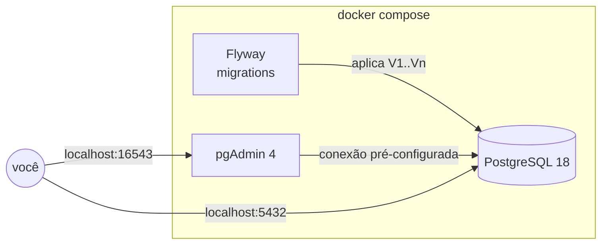

# Pauta Digital — PostgreSQL com Docker e Flyway

> Laboratório de PostgreSQL com Docker baseado em um caso de negócio fictício: a **Pauta Digital**, uma plataforma de revistas e newsletters por assinatura.

O foco do projeto é a infraestrutura do banco: subir o PostgreSQL com **Docker Compose**, versionar o schema com **migrations do Flyway** e **evoluir um banco que já tem dados** sem perdê-los.

> **Status:** em construção. O [roadmap](#roadmap) mostra o que já foi implementado.

---

## O caso

A Pauta Digital vende acesso a um catálogo de publicações digitais (revistas e newsletters) em planos mensais, anuais e familiares. O banco guarda planos, publicações, assinantes e assinaturas, com as regras de negócio garantidas pelo próprio PostgreSQL: e-mail único, uma assinatura em andamento por assinante, cancelamento sempre com data e motivo.

Detalhes do negócio: [docs/caso-de-negocio.md](docs/caso-de-negocio.md).

## Arquitetura



| Serviço    | Papel                                                              | Fica rodando |
|------------|--------------------------------------------------------------------|--------------|
| `postgres` | Banco de dados, com healthcheck e `pg_stat_statements` habilitado  | Sim |
| `flyway`   | Aplica as migrations pendentes em `migrations/` e encerra          | Não (`Exited (0)`) |
| `pgadmin`  | Interface web, com o servidor já cadastrado via `servers.json`     | Sim |

O Flyway e o pgAdmin só sobem depois que o healthcheck do Postgres passa (`depends_on: service_healthy`).

Por que essas escolhas: [docs/decisoes.md](docs/decisoes.md).

## Estrutura do repositório

```
.
├── docker-compose.yml
├── .env.example              # variáveis (senhas, portas) — copie para .env
├── migrations/               # evolução do schema, versionada (Flyway)
│   └── V1__schema_inicial.sql
├── initdb/                   # roda só na 1ª subida: extensões do servidor
│   └── 01_extensoes.sql
├── pgadmin/
│   └── servers.json          # conexão pré-cadastrada no pgAdmin
└── docs/
    ├── caso-de-negocio.md
    ├── modelo-de-dados.md
    ├── decisoes.md
    ├── checklist.md          # plano de trabalho por versão
    └── criando/              # passo a passo de cada etapa, com os problemas encontrados
```

## Como rodar

**Pré-requisitos:** Docker com o plugin Compose v2 (`docker compose`).

```bash
# 1. Clonar e configurar
git clone https://github.com/00MOREIRA00/docker-postgresql-pgadmin.git
cd docker-postgresql-pgadmin
cp .env.example .env          # defina POSTGRES_PASSWORD e PGADMIN_PASSWORD

# 2. Subir tudo
docker compose up -d

# 3. Conferir
docker compose ps -a
```

O esperado:

| Container        | Status          |
|------------------|-----------------|
| `pauta-postgres` | `Up (healthy)`  |
| `pauta-flyway`   | `Exited (0)`    |
| `pauta-pgadmin`  | `Up`            |

**Conferir se as migrations rodaram**

```bash
docker compose logs flyway
```

Procure `Successfully applied N migration` na primeira subida, ou `Schema "public" is up to date` quando não há nada novo. O `Exited (0)` sozinho não garante que uma migration foi aplicada: um arquivo com nome fora do padrão (`v1__...` em vez de `V1__...`) é ignorado sem erro.

**Acessos**

| O quê    | Onde                            | Credenciais         |
|----------|---------------------------------|---------------------|
| pgAdmin  | http://localhost:16543          | definidas no `.env` |
| Postgres | `localhost:5432`, banco `pauta` | definidas no `.env` |

O pgAdmin já abre com o servidor **Pauta Digital (local)** cadastrado (grupo *Laboratório*). No primeiro acesso, ele pede a senha do banco (`POSTGRES_PASSWORD`). Ele leva cerca de um minuto para ficar disponível.

Dentro da rede do compose, o host do banco é `postgres`.

**Teste rápido pelo terminal**

```bash
docker compose exec postgres psql -U postgres -d pauta -c "SELECT codigo, nome, preco_centavos FROM planos;"
```

**Encerrar**

```bash
docker compose down        # para os containers, mantém os dados
docker compose down -v     # para e apaga os volumes (recomeça do zero)
```

## Migrations

| Versão | Arquivo | Conteúdo |
|--------|---------|----------|
| V1 | `V1__schema_inicial.sql` | Extensão `citext`, ENUMs, 6 tabelas, constraints, índice único parcial e carga dos planos e publicações |
| V2 | `V2__cupons.sql` *(a fazer)* | Tabela `cupons` e coluna `cupom_id` em `assinaturas`, aplicada num banco com dados |

Regra de ouro: **migration aplicada não se edita**. O Flyway guarda um checksum de cada arquivo em `flyway_schema_history` e recusa alterações; correções entram como uma nova versão.

Modelo completo: [docs/modelo-de-dados.md](docs/modelo-de-dados.md).

## O que o projeto demonstra

| Tema | Onde ver |
|------|----------|
| Compose com healthcheck, `depends_on: service_healthy`, volumes e rede | `docker-compose.yml` |
| Credenciais fora do código | `.env.example` |
| Scripts de inicialização do Postgres | `initdb/` |
| Migrations versionadas com Flyway | `migrations/` |
| Modelagem relacional: PK/FK, `CHECK`, `ENUM`, `citext` | `migrations/V1` |
| Índice único parcial (uma assinatura em andamento por assinante) | `migrations/V1` |
| Evolução de schema sem perder dados | `migrations/V2` *(a fazer)* |
| Backup e restore com `pg_dump` / `pg_restore` | *(a fazer)* |

O passo a passo de cada etapa, com os erros que apareceram e como foram resolvidos, está em [docs/criando/](docs/criando/).

## Roadmap

- [x] Corrigir a base do compose (ver [melhorias.md](melhorias.md))
- [x] `.env.example`, healthcheck, `servers.json` do pgAdmin e `pg_stat_statements`
- [x] Serviço Flyway + `V1` schema inicial
- [ ] Dados de exemplo em SQL e `V2` cupons, aplicada sem apagar o banco
- [ ] Backup e restore
- [ ] README final

Detalhes de cada versão: [docs/checklist.md](docs/checklist.md).

## Aviso

Projeto de estudo. Defina suas credenciais no `.env`; o `.env.example` não contém senhas. Esta configuração é destinada ao uso local.
