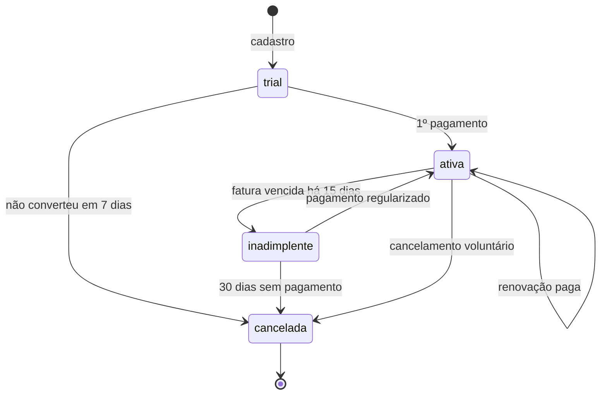

# Caso de negócio — Pauta Digital

> Empresa fictícia criada para este laboratório. Qualquer semelhança com empresas reais é coincidência.

## A empresa

A **Pauta Digital** é uma plataforma brasileira de assinatura de conteúdo. Com uma assinatura, o leitor acessa um catálogo de **publicações digitais**: revistas (edições mensais) e newsletters (envios semanais) sobre economia, tecnologia, cultura e esportes.

A empresa começou pequena, controlando assinaturas em planilhas. Com o crescimento, migrou para PostgreSQL. O banco precisa sustentar a operação (cobrança, cancelamentos, acesso) **e** responder às perguntas do negócio.

## Planos

| Plano | Periodicidade | Preço | Publicações | Perfis |
|-------|---------------|-------|-------------|--------|
| Essencial | Mensal | R$ 19,90 | Newsletters | 1 |
| Completo | Mensal | R$ 39,90 | Todas | 1 |
| Completo Anual | Anual | R$ 399,00 | Todas | 1 |
| Família | Mensal | R$ 59,90 | Todas | até 4 |

Os preços são guardados em **centavos** (`integer`), nunca em `float`.

## Ciclo de vida de uma assinatura

## Regras de negócio

1. **Uma assinatura ativa por assinante.** Um assinante pode ter várias assinaturas no histórico, mas só uma com status `trial`, `ativa` ou `inadimplente` por vez.
2. **Trial de 7 dias.** Toda assinatura nova começa em `trial`. Sem pagamento ao fim do período, é cancelada com o motivo `trial_nao_convertido`.
3. **Fatura por ciclo.** Na renovação, é gerada uma fatura com vencimento em 5 dias. Status: `aberta`, `paga`, `vencida`, `estornada`.
4. **Inadimplência.** Uma fatura vencida há mais de 15 dias move a assinatura para `inadimplente`. Depois de 30 dias, ela é cancelada com o motivo `inadimplencia`.
5. **Troca de plano.** Vale a partir do próximo ciclo e fica registrada no histórico da assinatura.
6. **Cancelamento voluntário.** Exige um motivo (`preco`, `conteudo`, `pouco_uso`, `outro`). O acesso continua até o fim do período já pago.
7. **Cupons** *(a partir da V3)*. Percentual ou valor fixo, com validade e limite de usos. Aplicam-se às N primeiras faturas.
8. **Auditoria.** Toda alteração em assinaturas, faturas e pagamentos é registrada automaticamente (quem, quando, antes e depois).

## Áreas e acessos

| Área | Precisa de | Não pode ver |
|------|-----------|--------------|
| **Aplicação** (`app_pauta`) | Leitura e escrita nas tabelas operacionais | Tabela de auditoria (só insere via trigger) |
| **Financeiro** (`financeiro`) | Faturas, pagamentos, views de receita | Dados pessoais além de nome e e-mail |
| **Editorial** (`editorial`) | Publicações e engajamento por plano | Qualquer dado financeiro |
| **Atendimento** (`atendimento`) | Assinantes e assinaturas **da sua região (UF)** | Assinantes de outras regiões — garantido por **RLS** |

## Perguntas de negócio

Cada pergunta tem uma consulta correspondente em `queries/`.

### Operação

1. Quantos assinantes ativos temos hoje, por plano?
2. Quais faturas vencem nos próximos 7 dias?
3. Quem está inadimplente, há quantos dias e com quanto em aberto?
4. Qual o histórico completo de um assinante (assinaturas, trocas de plano, pagamentos)?

### Receita

5. Qual o **MRR** atual? (Planos anuais entram como 1/12 do valor.)
6. Como o MRR evoluiu mês a mês e qual foi o crescimento percentual?
7. Quanto foi faturado *versus* recebido por mês?
8. Qual o **ticket médio** por plano e por método de pagamento?

### Retenção

9. Qual a **taxa de churn mensal**, por plano?
10. **Coorte:** dos assinantes que entraram em cada mês, quantos % seguem ativos em M+1, M+3, M+6?
11. Quais os principais motivos de cancelamento, por plano?
12. Qual a **taxa de conversão do trial**?
13. Qual o **LTV médio** por plano?

### Marketing *(a partir da V3)*

14. Quais cupons trouxeram mais assinantes?
15. Assinantes que entraram com cupom cancelam mais cedo do que os que pagaram preço cheio?

### Performance

16. Quais consultas mais consomem tempo no banco (`pg_stat_statements`)?
17. Qual o ganho de tempo na consulta X depois de criar o índice Y (`EXPLAIN ANALYZE` antes e depois)?

## Volume de dados esperado

O seed padrão gera um volume suficiente para que índices e planos de execução façam diferença:

| Entidade | Volume aproximado |
|----------|-------------------|
| Assinantes | 5.000 (configurável) |
| Assinaturas | ~7.000 (inclui reassinaturas) |
| Faturas | ~60.000 (até 24 meses de histórico) |
| Pagamentos | ~55.000 |
| Registros de auditoria | ~150.000 |
