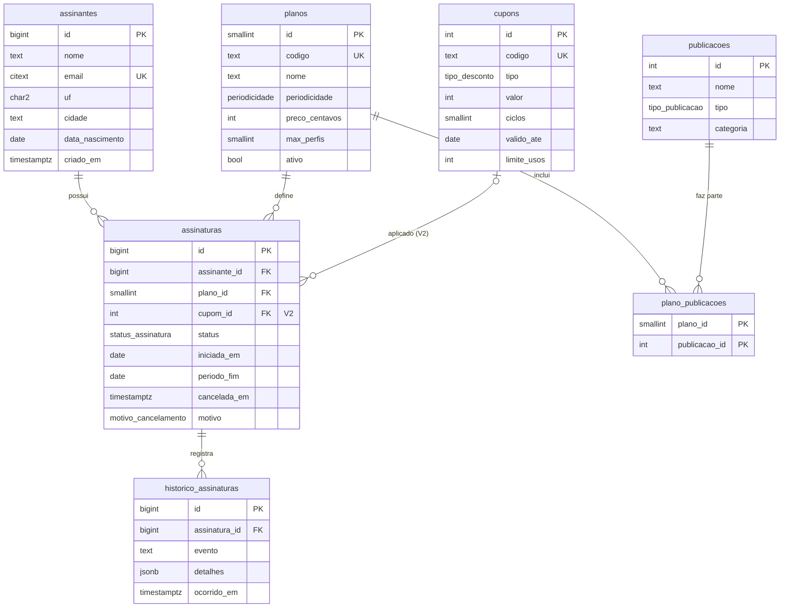

# Modelo de dados

O schema é criado e evoluído pelas migrations do Flyway, em `migrations/`. A migration que introduz cada parte está indicada.

## Diagrama

## Tipos enumerados

| Tipo | Valores | Migration |
|------|---------|-----------|
| `periodicidade` | `mensal`, `anual` | V1 |
| `tipo_publicacao` | `revista`, `newsletter` | V1 |
| `status_assinatura` | `trial`, `ativa`, `inadimplente`, `cancelada` | V1 |
| `motivo_cancelamento` | `preco`, `conteudo`, `pouco_uso`, `inadimplencia`, `trial_nao_convertido`, `outro` | V1 |
| `tipo_desconto` | `percentual`, `valor_fixo` | V2 |

## Restrições importantes

| Regra de negócio | Como o banco garante | Migration |
|------------------|----------------------|-----------|
| E-mail único, sem diferenciar maiúsculas de minúsculas | Tipo `citext` (extensão) + `UNIQUE` | V1 |
| Uma assinatura em andamento por assinante | Índice único **parcial**: `UNIQUE (assinante_id) WHERE status <> 'cancelada'` | V1 |
| Data e motivo de cancelamento existem se, e somente se, a assinatura está cancelada | `CHECK ((status = 'cancelada') = (cancelada_em IS NOT NULL) AND (status = 'cancelada') = (motivo IS NOT NULL))` | V1 |
| Preço não negativo | `CHECK (preco_centavos >= 0)` | V1 |
| Todo plano tem ao menos 1 perfil | `CHECK (max_perfis >= 1)` | V1 |
| UF no formato de duas letras maiúsculas | `CHECK (uf ~ '^[A-Z]{2}$')` | V1 |
| Código de plano único | `UNIQUE (codigo)` | V1 |

## Dados fixos

Carregados pelo V1, porque fazem parte do negócio e precisam existir em qualquer banco:

- **4 planos:** Essencial, Completo, Completo Anual e Família (preços em centavos, ver [caso de negócio](caso-de-negocio.md)).
- **8 publicações:** uma revista e uma newsletter por categoria (economia, tecnologia, cultura e esportes).
- **28 ligações plano × publicação:** o Essencial inclui só as newsletters; os demais incluem todas.

## Evolução por migrations

| Versão | Arquivo | Conteúdo | Status |
|--------|---------|----------|--------|
| V1 | `V1__schema_inicial.sql` | Extensão `citext`, ENUMs, as 6 tabelas, constraints, índice parcial e carga dos dados fixos | ✅ Aplicada |
| V2 | `V2__cupons.sql` | Tabela `cupons` e coluna `cupom_id` em `assinaturas`, aplicada num banco **com dados**, sem perdê-los | ⬜ A fazer |

Regra de ouro: **migration aplicada não se edita**. Correções entram como uma nova versão.

> A tabela `historico_assinaturas` existe desde o V1, mas não há trigger que a preencha: automatizar o histórico ficou fora do escopo do projeto.
