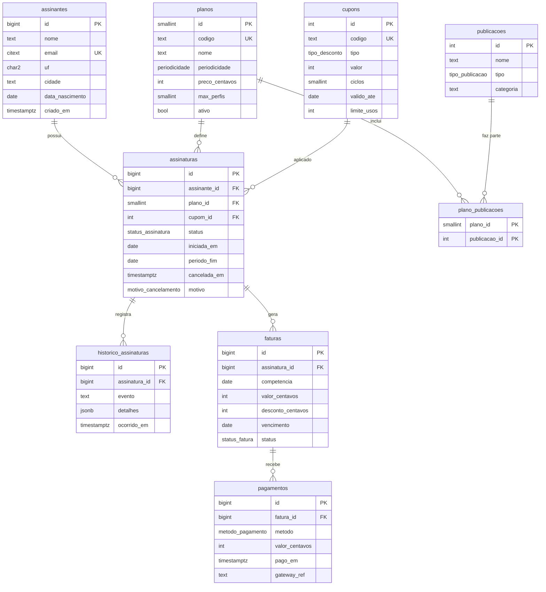

# Modelo de dados

Este é o modelo-alvo. A migration que introduz cada parte está indicada.

## Diagrama

A tabela `auditoria` (V2) fica fora do diagrama porque não tem FK: ela registra qualquer tabela auditada.

## Tipos enumerados

| Tipo | Valores |
|------|---------|
| `periodicidade` | `mensal`, `anual` |
| `tipo_publicacao` | `revista`, `newsletter` |
| `status_assinatura` | `trial`, `ativa`, `inadimplente`, `cancelada` |
| `motivo_cancelamento` | `preco`, `conteudo`, `pouco_uso`, `inadimplencia`, `trial_nao_convertido`, `outro` |
| `status_fatura` | `aberta`, `paga`, `vencida`, `estornada` |
| `metodo_pagamento` | `cartao`, `pix`, `boleto` |
| `tipo_desconto` *(V3)* | `percentual`, `valor_fixo` |

## Restrições importantes

| Regra de negócio | Como o banco garante |
|------------------|----------------------|
| E-mail único, sem diferenciar maiúsculas de minúsculas | Tipo `citext` (extensão) + `UNIQUE` |
| Uma assinatura ativa por assinante | Índice único **parcial**: `UNIQUE (assinante_id) WHERE status <> 'cancelada'` |
| Cancelada precisa de data e motivo | `CHECK ((status = 'cancelada') = (cancelada_em IS NOT NULL AND motivo IS NOT NULL))` |
| Valores não negativos | `CHECK (valor_centavos >= 0)` |
| Desconto não maior que o valor | `CHECK (desconto_centavos <= valor_centavos)` |
| UF válida | `CHECK (uf ~ '^[A-Z]{2}$')` |
| Uma fatura por assinatura e competência | `UNIQUE (assinatura_id, competencia)` |

## Objetos além de tabelas

| Objeto | Tipo | Migration | Para quê |
|--------|------|-----------|----------|
| `fn_auditoria()` | Função + triggers | V2 | Grava antes e depois em `auditoria` (`jsonb`), com usuário e timestamp |
| `fn_historico_assinatura()` | Trigger | V2 | Registra mudanças de status e de plano em `historico_assinaturas` |
| `vw_assinantes_ativos` | View | V2 | Assinante + plano atual, para a operação |
| `vw_receita_mensal` | View | V2 | Faturado *versus* recebido por competência |
| `mv_mrr_mensal` | Materialized view | V2 | MRR por mês, atualizada pelo script (`REFRESH ... CONCURRENTLY`) |
| Índices de performance | Índices | V4 | Criados a partir dos planos de execução de `queries/04` |
| Roles e políticas | `GRANT` + RLS | V5 | Privilégio mínimo e filtro por UF no atendimento |

## Evolução por migrations

| Versão | Arquivo | Conteúdo |
|--------|---------|----------|
| V1 | `V1__schema_inicial.sql` | Extensões, enums, assinantes, planos, publicações, assinaturas, histórico |
| V2 | `V2__faturas_pagamentos_auditoria.sql` | Faturas, pagamentos, auditoria, triggers, views |
| V3 | `V3__cupons.sql` | Tabela de cupons e coluna `cupom_id` em assinaturas, sem perder dados existentes |
| V4 | `V4__indices_performance.sql` | Índices justificados por `EXPLAIN ANALYZE` |
| V5 | `V5__roles_rls.sql` | Roles `app_pauta`, `financeiro`, `editorial`, `atendimento` e políticas de RLS |

Regra de ouro: **migration aplicada não se edita**. Correções entram como uma nova versão.
